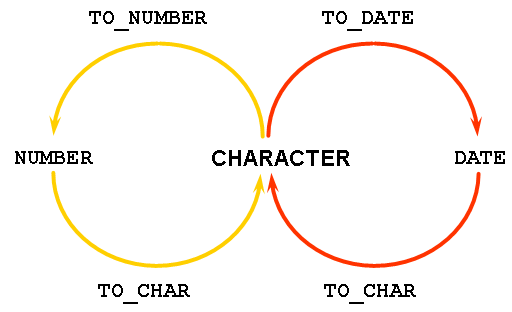

# Data Type

- 字符
- 数字
- 日期
- 其他

> 字符数据类型

- CHAR
- **VARCHAR2**
  - max:4000字符, before 12c
  - max:32KB, 12c
- NCHAR/NVARCHAR2
  - 字符集
  - NLS, 国家语言集
- LONG
- **CLOB**/NCLOB
  - max:4GB, before 10g
  - max:128TB, after 10g

> 数字数据类型

- **NUMBER**
  - default:NUMBER(38, 0)
  - NUMBER(10, -2), 小数点左边指定位置进行四舍五入
- BINARY_FLOAT
  - after 10g
- BINARY_DOUBLE
  - after 10g
- SIMPLE_INTEGER
  - after 11g

> 日期数据类型 DATE

- DATE
  - format: DD-MON-YY HH:MI:SS
  - default: 0
  - NLS_DATE_FORMAT
- TIMESTAMP(9i)
  - 与date数据类型相比，timestamp类型可以精确到微秒，微秒的精确范围为0-9，默认为6
  - TIMESTAMP WITH TIME ZONE (TSTZ)
  - TIMESTAMP WITH LOCAL TIME ZONE (TSLTZ)

=> [日期类型函数](func_date.md)


> 其他数据类型

- RAW/LONG RAW
- ROWID
- ORA_ROWSCN
- LOB
  - CLOB
  - NCLOB
  - BLOB
- BFILE
- XMLType
  - 把XML文档以字符的形式存储在LOB列中
- 身份数据类型
  - 12c
  - DB2 to Oracle
- 用户自定数据
- AnyType/AnyData/AnyDataSet

> 数据类型转换

- 显式转换
```oracle
CHARACTER ==TO_DATE==> DATE ==TO_CHAR==> CHARACTER

CHARACTER ==TO_NUMBER==> NUMBER ==TO_CHAR==> CHARACTER
```

- 隐式转换
```oracle
VARCHAR2 or CHAR => NUMBER
VARCHAR2 or CHAR => DATE
```


