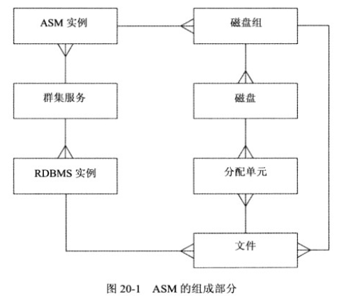

# Oracle Automatic Storage Management (ASM)
自动存储管理
Oracle ASM a high-performance, ease-of-management storage solution for Oracle Database files.

## Evolution

- 数据字典管理 => 本地管理表空间
- 手工段管理MSSM => 自动段管理ASSM
- RAW/FILE SYSTEM => ASM

## LVM
逻辑卷管理器

Oracle感知的LVM。

ASM磁盘必须是没有文件系统的原始磁盘，但不必是实际的磁盘，它们可以是磁盘、磁盘的分区或LVM管理的逻辑卷。

## ASM体系结构

- asm磁盘和磁盘组
- asm实例
- rdbms实例
- asm文件

ASM只能用于数据库和恢复文件(归档重做日志文件、RMAN备份集、RMAN映像副本、闪回恢复区)，而不能用于Oracle Home或其他任何事物。
ASM只能存储数据库文件(控制文件、数据文件、联机重做日志文件、临时文件)，不能存储二进制文件。始终必须将 Oracle 主目录保存在常规文件系统上。
数据库文件的定义很宽泛，但是不包括跟踪文件、警报日志、口令文件或静态参数文件。

ASM镜像默认是单镜像，但是可以设置为无镜像或双镜像；不能禁用条带化。

常规的磁盘活动不涉及ASM实例。ASM是一种使文件可用的管理和控制功能，它不执行实际的I/O工作。

再平衡操作将自动启动以响应磁盘组重配置。

RMAN是可以用来备份ASM文件的唯一工具。由于操作系统应用程序不能查看ASM文件，因此无法执行用户管理的备份。

RBAL进程。

## Reference

- [Automatic Storage Management Administrator's Guide](https://docs.oracle.com/cd/E11882_01/server.112/e18951/toc.htm)
- [Administering Oracle Automatic Storage Management](https://docs.oracle.com/cd/E11882_01/server.112/e10897/asm.htm#ADMQS12100)

=====================================================================================

- ASM 准备环境
- 利用 DBCA 创建 ASM 实例
- ASM 磁盘组上创建表空间
- 通过 asmcmd 查看生成的数据文件
- 命令行删除磁盘组
- 命令行创建磁盘组
- 修改磁盘组
- 利用 RMAN 将数据库文件系统迁移到 ASM